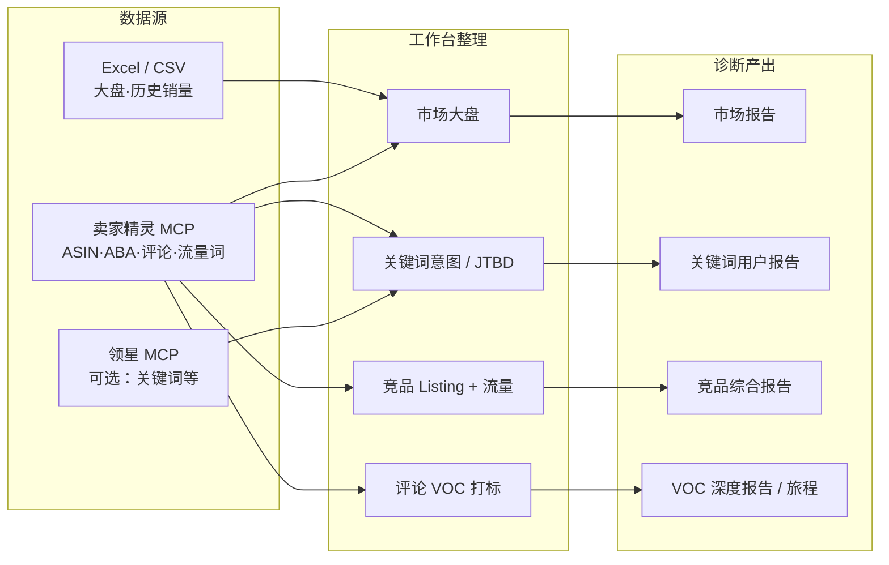

<div align="center">

# AmzDev Tool

**亚马逊市调 × 用户洞察工作台**

把大盘、关键词、竞品 Listing 和评论，收成一份能拍板的诊断——  
少在 Excel / 飞书 / 微信里来回翻，多在「用户要买什么、还差什么」上对齐。

[在线演示](https://webapp-amazonmarketsearch.vercel.app) · [功能模块](#-五大模块做什么) · [数据怎么流](#-从数据源到诊断分析) · [你需要接入什么](#-你需要接入什么) · [本地运行](#-本地运行)

</div>

---

## 这是给谁用的？

| 角色 | 典型痛点 | AmzDev 怎么帮 |
| --- | --- | --- |
| 亚马逊运营 | 词表只有搜索量 / CPC，写不出转化卖点 | 意图分层 + JTBD，把词变成「用户要完成的任务」 |
| 产品 / 开发 | 评论翻半天，洞察写不进 Brief | VOC 打标 + 深度报告，直接可进 Listing / 开发清单 |
| 项目负责人 | 报告散落各处，决策靠拍脑袋 | 大盘 → 关键词 → 竞品 → 评论同一套工作流 |

> **不用先配密钥也能看懂能力**：打开 [在线演示](https://webapp-amazonmarketsearch.vercel.app)，用「游客进入」或登录后加载示例数据（美国站薄枕头真实样例 + 预置 AI 报告样例）。

---

## 五大模块做什么？

| 模块 | 业务结果（你拿走什么） |
| --- | --- |
| **市场大盘** | 看清品类规模、集中度、价格带、头部品牌与新品窗口；可一键出市场洞察报告 |
| **关键词分析** | 从 ABA / 流量词到「认知→考虑→决策」意图 + JTBD 任务聚类；可出用户洞察报告 |
| **竞品对比** | Listing / 主图 / 五点 / 流量词 / 父体矩阵并排；可出竞品综合 AI 报告 |
| **用户洞察（评论）** | 好评点 / 差评点 / 场景 / 人群打标；深度报告与用户旅程 |
| **利润计算器** | 粗算 FBA 模型是否扛得住（定价、费用、毛利） |

---

## 从数据源到诊断分析

核心逻辑不是「再做一个看板」，而是：

**多源数据 → 结构化整理 → 诊断提问 → AI / 规则出结论 → 可执行动作**



### 诊断在问什么？（方便你对内讲清楚）

| 阶段 | 关键问题 | 主要依据 |
| --- | --- | --- |
| 选品 / 入场 | 这个池子有没有量？是不是卷死了？价格带在哪？ | 大盘销量、集中度、评分分布、上架时间 |
| 需求理解 | 用户到底在搜什么「任务」？决策词是哪些？ | 意图分层、JTBD、场景 × 人群 |
| 对标差距 | 别人 Listing / 流量结构强在哪？我们缺哪张图、哪句五点？ | 竞品主图、卖点、流量词、父体矩阵 |
| 体验验证 | 买家夸什么、骂什么、预期差在哪？ | 评论标签、深度报告、用户旅程 |
| 商业可行性 | 这套定价 / 费用打不打得过？ | 利润计算器 |

### 推荐使用顺序（第一次用就按这个走）

1. **游客 / 示例**先逛一遍，建立「工具能干什么」的体感  
2. **设置 → AI**：填一个大模型 Key（出报告用）  
3. **设置 → MCP 数据**：填卖家精灵（和可选领星）密钥（在线抓数用）  
4. 上传自己的 **大盘 + 历史 Excel**，或用 MCP 按 ASIN / 关键词拉取  
5. 按 **大盘 → 关键词 → 竞品 → 评论** 跑完一轮，导出 / 复制报告给团队

---

## 你需要接入什么？

密钥都存在**你自己的浏览器本地**（localStorage），应用不会把 Key 存到我们的业务服务器。线上演示站通过同源代理转发请求，避免浏览器跨域。

### 1）AI 大模型（生成报告必填）

在应用内：**设置 → API 与模型**

| 可选供应商 | 用途 |
| --- | --- |
| DeepSeek / 通义千问 / Moonshot / 智谱 | 国内常用，性价比高 |
| OpenAI / Claude / Gemini | 也可 |

**用来干什么**：市场报告、关键词用户报告、竞品综合报告、评论打标与深度报告等。

> 不配 AI Key：仍可看大盘图表、示例数据、手动分析；只是「一键 AI 报告」不可用。

### 2）卖家精灵 MCP（在线抓数强烈推荐）

在应用内：**设置 → MCP 数据 → 卖家精灵**，填 Secret Key。  
MCP 地址一般**留空**（走应用内代理）。

**可抓内容（视账号权限）**：ASIN 详情、ABA / 流量关键词、评论、竞品对比相关数据等。

### 3）领星 MCP（可选）

同样在 **MCP 数据** 里添加「领星」条目，填密钥。  
适合已有领星生态、需要补充关键词等能力的团队。

### 4）Excel / CSV（不配 MCP 也能用）

上传两份常见市调导出即可：

| 文件 | 内容 |
| --- | --- |
| 产品 / ASIN 列表 | 价格、销量、评分、品牌、类目等 |
| 历史表现大盘 | 按月销量 / 销售额等时间序列 |

支持 `.xlsx` / `.xls` / `.csv`。

### 接入对照（一眼看懂）

| 你想做的事 | 最少需要 |
| --- | --- |
| 只看演示、评估产品 | 浏览器打开演示站 → 游客 / 示例 |
| 自己的 Excel 出大盘图 | 上传两份表 |
| 在线拉 ASIN / 词 / 评论 | **卖家精灵 MCP Key** |
| 一键出 AI 洞察报告 | **AI API Key**（+ 上面任一数据） |
| 完整「数据→诊断」闭环 | AI Key + 卖家精灵 Key（领星可选）+ 或 Excel |

---

## 隐私与安全（简要）

- 登录账号、AI Key、MCP Key、工作区数据默认在**本机浏览器**（含 IndexedDB）
- 不会把你的密钥写进 Git 仓库；请勿把 `.env.local` 提交上去
- 演示站与自建部署都会走 `/api-proxy/*` 同源转发到各家 API / MCP

---

## 本地运行

**环境**：Node.js 18+（建议 LTS）

```bash
git clone https://github.com/Ray-2026426/Webapp_amazonmarketsearch.git
cd Webapp_amazonmarketsearch
npm install
cp .env.example .env.local   # 可选；Key 更推荐在应用「设置」里填
npm run dev
```

浏览器打开终端提示的地址（默认 `http://localhost:3000`）。

常用脚本：

```bash
npm run dev      # 本地开发
npm run build    # 生产构建
npm run preview  # 预览构建结果
npm run lint     # TypeScript 检查
```

`.env.local` 里多为可选兜底（见 `.env.example`）；**日常使用优先在页面设置里配置**，团队协作时也不容易误提交密钥。

### 部署到 Vercel

仓库已含 `vercel.json`（含 AI / 卖家精灵 MCP 代理规则）。  
连接 GitHub 后按 Vite 项目导入即可；演示地址示例：

**https://webapp-amazonmarketsearch.vercel.app**

---

## 技术栈（给工程师）

- React 19 + Vite + TypeScript + Tailwind CSS  
- 图表：Recharts；报告：Markdown / HTML；存储：idb-keyval  
- 数据：Excel 解析（xlsx）+ 卖家精灵 / 领星 MCP（经同源代理）

---

## 路线图（公开意向）

- [ ] 更多站点与品类的示例包  
- [ ] 报告导出模板（飞书 / Notion 友好）  
- [ ] 团队空间与权限（当前以本机工作区为主）

欢迎 Issue / PR。若你是运营或产品同学，直接试用 [在线演示](https://webapp-amazonmarketsearch.vercel.app) 反馈「哪一步看不懂」最有价值。

---

<div align="center">

Made for Amazon ops & PMs · AmzDev Tool

</div>
