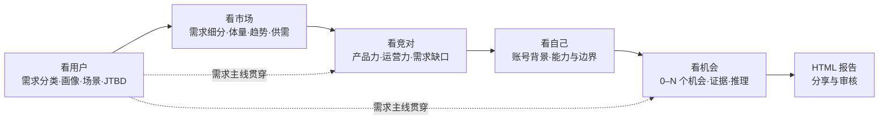

<div align="center">

# AmzDev Tool

**亚马逊新品立项与品类机会洞察工作台**

把关键词、评论、市场、竞品和团队能力串成证据链，帮助产品经理、选品人员和老板回答：

**这个品类有没有尚未被满足的需求？如果有，机会是什么，为什么？**

[在线演示](https://webapp-amazonmarketsearch.vercel.app) · [产品总纲](./docs/product-charter.md) · [Phase 0 优化 PRD](./docs/phase0-business-ui-optimization-checklist.md) · [对抗式审查](./docs/phase0-adversarial-review.md) · [本地运行](#本地运行)

</div>

---

## 先读这两份文档

如果你是接手项目的产品、设计、开发或 AI，请按顺序阅读：

1. [产品总纲](./docs/product-charter.md)：产品为什么存在、机会如何定义、五看如何串联、UI 应遵守什么、Phase 0 明确不做什么。
2. [Phase 0 业务与 UI 优化 PRD](./docs/phase0-business-ui-optimization-checklist.md)：已确认的下一阶段页面方案、AI Prompt、验收标准和实施顺序。

README 只负责快速理解与运行项目，不代替产品总纲。Phase 0 的核心闭环已在 `phase-0` 分支落地；后续改动应以产品总纲的业务定义和代码中的确定性测试为共同约束。

## Phase 0 当前实现状态

已落地的核心路径：

- 项目中心改为少量深度项目的宽卡入口；新建只要求研究目标和站点，并从“看用户”开始。
- 项目内提供“项目结论 → 五看 → 对象详情”层级，顶部持续显示 30 分钟路径和当前需求主线。
- 看用户可维护需求分类、画像、场景、JTBD、决策路径、替代方案和已/未满足部分，并选择细分标准。
- 看市场可关联需求、比较细分机会，并在细分二级页复用趋势、集中度、价格、卖家、新老品等大盘图表。
- 看竞对按头部、跟随者、新进入者组织，提供产品力、运营力、需求满足矩阵和“我们如何赢”。
- 看自己自动读取账号背景，并由 AI 结合当前品类生成 3–7 个引导问题。
- 看机会支持 AI 生成 0–N 个候选、人工确认/编辑/合并/删除、反证审查、明确区分无机会与证据不足。
- 机会评分只读取当前机会绑定的四看证据，不再用页面完成度冒充商业质量。
- Prompt 管理中心包含四个 `phase0-v1` 预设；机会结论可导出为独立、可打印的 HTML 审核报告。

当前仍依赖外部条件的能力：真实 AI 生成需要用户配置模型 API Key；在线 ASIN/关键词/评论抓取需要相应数据连接。缺少这些配置时可维护手工结构化结论，但系统不能凭空补造证据。

## 产品要解决的问题

传统亚马逊市调经常停留在“市场多大、搜索量多少、谁卖得好”，但新品立项真正需要判断的是：

- 用户是谁，在什么场景下完成什么任务？
- 用户有哪些需求，现有产品满足了多少？
- 哪个需求细分市场正在增长或供不应求？
- 头部、跟随者和新进入者靠什么赢，哪里仍然没做好？
- 我们的供应链、预算、经验和利润边界是否能承接？
- 最终是否存在一个可以被证据支持的机会？

AmzDev Tool 的目标不是生成更多图表，而是在约 30 分钟内完成一次初步品类拆解，并输出可供同事或审核者阅读的 HTML 结论报告。

## 什么才算机会

产品只承认两类机会：

- **市场型机会**：需求增长、市场水涨船高或供不应求，新的供给仍有进入空间。
- **缺口型机会**：竞品没有完全满足明确用户的功能、价格、体验、场景或其他需求。

最终可以得到 **0–N 个机会**。没有充分证据时必须输出 0，并区分：

- 已判断无机会。
- 证据不足，暂不能判断。

市场大、搜索量高或存在零散差评，都不能单独证明机会成立。

## 五看工作流



推荐顺序是“看用户 → 看市场 → 看竞对 → 看自己 → 看机会”。其中看用户产生的需求分类不是一次性报告，而是后续市场细分、竞品满足判断和机会生成的统一索引。

项目五看界面统一称为“看竞对”；独立的历史工具菜单仍保留“竞品分析”名称，以避免混淆工具与研究视角。

| 视角 | 核心问题 | 目标产物 |
| --- | --- | --- |
| 看用户 | 谁的什么需求没有被满足？ | 需求分类、用户画像、场景、JTBD、决策路径、替代方案 |
| 看市场 | 需求对应的细分市场有没有进入窗口？ | 细分评分、趋势、体量、供需、集中度、价格带 |
| 看竞对 | 代表竞品靠什么赢，哪里仍未满足用户？ | 产品力、运营力、需求满足矩阵、可攻击缝隙 |
| 看自己 | 我们是否有能力和边界承接？ | 账号背景、品类问题、优势、缺口、硬约束 |
| 看机会 | 最终是否存在可信机会？ | 0–N 张机会卡、评分、证据、推理、反证、人工结论 |

## 当前已有能力

- 市场大盘：市场趋势、价格带、品牌/ASIN 集中度、新老品、上架时间、BSR、评分、卖家等分析。
- 关键词分析：搜索意图、JTBD、场景、人群、痛点和长尾机会。
- 用户洞察：评论/VOC 打标、情绪、好评点、差评点、画像、旅程和 AI 报告。
- 竞品分析：Listing、主图/A+、流量词、历史趋势和产品矩阵。
- 市场细分：细分评分与目标细分选择。
- 项目工作区：项目、五看进度、本地持久化、可选云同步、成员与报告资产。
- AI 配置与 Prompt 管理：多模型供应商、结构化分析和可编辑 Prompt。
- 利润计算器：价格、成本、费用和毛利的情景估算。
- 演示数据：未配置真实密钥时可用于理解主要能力。

## 后续优化优先级

Phase 0 已先打通业务闭环。下一阶段应优先提高真实证据的自动关联精度、让报告选择并内嵌更贴近结论的原始图表、加强不同数据源的刷新/过期提示，以及用真实用户任务验证 30 分钟完成率。不要在这些问题完成前引入任务、截止日期、提醒或复杂项目组合管理。

## UI 方向

现有视觉风格保持不变：靛青/紫色主色、白色与浅灰背景、克制渐变、柔和阴影、大圆角和友好的消费级工具体验。

后续优化重点是信息层级，不是换肤：

- 每页只有一个主标题、一句最强结论和一个主操作。
- 先结论，再证据，最后原始数据。
- 减少卡片套卡片，样本数和完成度降为次要信息。
- 看市场、看竞对等详细能力进入项目内二级页，不丢失项目与需求上下文。
- 状态不能只依赖颜色，关键正文不使用过小字号或永久截断。
- 空状态必须解释原因、缺少什么以及如何继续。

完整 UI 守则见 [产品总纲](./docs/product-charter.md#9-ui-设计纲领)。

## 数据从哪里来

| 数据源 | 用途 | 是否必需 |
| --- | --- | --- |
| 演示数据 | 快速理解产品能力 | 否 |
| Excel / CSV | 市场商品、历史销量等批量数据 | 可选 |
| 卖家精灵 MCP | ASIN、关键词、评论、流量和竞品数据 | 真实在线抓数时建议 |
| 领星相关能力 | 补充关键词等数据 | 可选 |
| AI 模型 API | 分类、洞察、引导问题、机会识别和报告 | AI 结论需要 |

密钥优先在应用“设置”中配置。不要把真实密钥写入 Git、截图、报告或共享文档。

## 本地运行

要求 Node.js 18+，建议使用当前 LTS。

```bash
npm install
npm run dev
```

默认开发地址：`http://localhost:3000`

可从 `.env.example` 复制环境变量模板到 `.env.local`。多数外部服务配置也可以在应用设置中完成。

## 开发命令

```bash
npm run dev      # 启动 Vite 开发服务器
npm test         # 运行业务与数据测试
npm run lint     # TypeScript 静态检查
npm run build    # 生产构建
npm run preview  # 预览构建产物
```

提交实现前，除纯文档修改外，应通过 `npm test`、`npm run lint` 和 `npm run build`。

## 项目结构

```text
src/
  App.tsx                         全局状态与主要页面装配
  components/
    ProjectCenter.tsx             项目中心
    ProjectWorkspace.tsx          项目内五看工作区
    ProjectOverview.tsx           项目概览
    MarketLookView.tsx            看市场
    UserLookView.tsx              看用户
    CompetitorLookView.tsx        看竞对
    SelfAssessmentView.tsx        看自己
    OpportunityLookView.tsx       看机会
    AiPromptManager.tsx           Prompt 管理中心
  types/researchProject.ts        项目、五看与机会核心类型
  utils/                          数据、AI、评分、存储与同步
tests/                            业务规则与数据测试
api/                              服务端/API 入口
server/                           本地服务能力
supabase/                         云端数据相关文件
docs/
  product-charter.md              产品总纲
  phase0-business-ui-optimization-checklist.md
                                   Phase 0 业务与 UI 优化 PRD
```

## 给后续 AI 或贡献者

- 先读 [AGENTS.md](./AGENTS.md)、[产品总纲](./docs/product-charter.md)和 [Phase 0 PRD](./docs/phase0-business-ui-optimization-checklist.md)。
- 先通过测试和实际页面区分“已落地规则”与“仍是体验目标”，不要只依据旧截图或单份文档下结论。
- 优先打通“未满足需求 → 市场验证 → 竞品缺口 → 自身适配 → 机会结论”，不要继续堆孤立数据卡。
- 不要强制 AI 生成机会；0 个机会是合法结论。
- 新的 AI 结论必须能追溯证据并允许人工修改。
- Phase 0 暂不加入验证任务、负责人、截止日期、提醒或复杂项目组合管理。
- 业务规则、页面职责或范围发生变化时，同时更新产品总纲和 Phase 0 PRD。

---

AmzDev Tool 的最终判断标准很简单：用户是否能更快、更可信地发现一个真实的未满足需求，并把结论讲清楚、交给别人审核。
