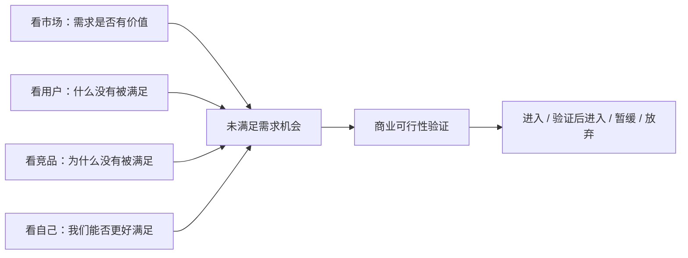

# 亚马逊市场调研 Web App 产品需求文档（PRD）

| 项目 | 内容 |
| --- | --- |
| 产品名称 | AmzDev 亚马逊市场调研工作台 |
| 文档版本 | V1.0 |
| 文档状态 | 已确认方法论，待进入产品化开发 |
| 目标用户 | 内部市场研究、运营、产品开发和项目负责人 |
| 目标版本 | 内部团队复用版 |
| 更新日期 | 2026-08-22 |

---

## 1. 文档目的

本 PRD 用于统一产品、设计、开发和 AI 编码代理对下一阶段产品化改造的理解。

本次改造不是继续增加零散分析功能，而是把现有市场、关键词、评论、竞品、ASIN、利润和 AI 报告能力组织为一套可持续复用的市场研究产品。

产品必须坚持“五看”方法论：

1. 看市场
2. 看用户
3. 看竞品
4. 看自己
5. 看/找机会

五看全部完成，才代表一次市场调研完成。

---

## 2. 产品背景

### 2.1 当前问题

现有应用已经具备市场大盘、关键词分析、竞品对比、单 ASIN 深度分析、用户洞察、利润计算和 AI 报告等能力，但仍存在以下产品问题：

- 功能以页面为中心，缺少统一的项目载体。
- 用户退出页面后，部分结果容易丢失或需要重新生成。
- 各模块之间缺少方法论关系，用户不清楚市调是否完整。
- 报告、数据和分析结果没有成为可持续复用的项目资产。
- AI 报告容易复述数据，或过度强调数据缺失与结论可靠性。
- 关键词、评论、竞品和利润之间没有共同服务于“发现未满足需求”。
- 缺少对团队自身目标、能力、资源和约束的系统分析。
- 管理员账号、API Key 和 MCP Key 的安全与使用便利性没有同时解决。
- 新增页面可能出现风格、颜色、字体、组件和交互逻辑不一致。

### 2.2 产品开发的核心判断

本产品采用以下定义：

> 市场机会，是一组具有商业价值、尚未被现有产品充分满足的用户需求。

因此，产品开发不只是寻找“大市场”“高销量”或“低竞争”，而是依次回答：

- 市场中是否存在足够规模和持续性的需求？
- 用户是谁，在什么场景下完成什么任务？
- 用户的哪些需求没有被现有产品充分满足？
- 现有竞品为什么没有满足，问题出在产品、体验、价格还是供给？
- 我们是否具备比现有竞品更好满足该需求的能力和资源？
- 这个解决方案能否在目标价格、成本和风险边界内成立？

最终产品价值不是输出更多数据，而是帮助团队找到并验证“未被满足的需求”。

---

## 3. 产品目标

### 3.1 核心目标

- 用项目承载一次完整的市场调研过程。
- 用五看方法论统一现有所有分析能力。
- 允许用户以不同顺序开展研究，同时保证最终完整性。
- 将关键词和 VOC 统一纳入“看用户”。
- 将 ASIN、品牌、卖家和产品组合统一纳入“看竞品”。
- 将目标、能力、资源、约束和利润边界纳入“看自己”。
- 以未满足需求为核心生成机会卡、机会优先级和决策报告。
- 自动保存数据和报告，支持再次进入、版本比较和团队复用。
- 保证管理员配置数据源方便，不需要每次重新填写 Key。
- 所有新增界面严格保持现有品牌与 UI 一致性。

### 3.2 成功指标

| 指标 | 目标 | 口径 |
| --- | ---: | --- |
| 项目恢复成功率 | >= 99% | 项目重新打开后，数据、报告、五看状态和工作位置完整恢复 |
| 五看闭环完成率 | >= 60% | 新建项目 7 天内完成五看并形成决策摘要 |
| 首个机会发现时间 | <= 30 分钟 | 从项目创建到形成第一张有证据的机会卡 |
| 报告复用率 | >= 50% | 报告生成后发生再次打开、导出、引用或比较 |
| 相同报告重复调用降低 | >= 50% | 相同数据指纹和 Prompt 版本下不重复调用 AI |
| 机会证据可追溯率 | 100% | 每张正式机会卡都可定位市场、用户、竞品和自身证据 |
| 严重展示错误 | 0 | 无乱码、Markdown 源码泄漏、表格破裂和文字遮挡 |

### 3.3 非目标

- 本阶段不建设外部客户订阅、支付和套餐体系。
- 不替代 ERP、广告投放、库存或供应链管理系统。
- 不自建 Keepa 或卖家精灵的数据采集基础设施。
- 不让 AI 自动替代最终立项决策。
- 不为了产品化重新设计一套与当前品牌无关的视觉风格。
- 第一阶段不强制接入云端，允许先以本地项目化方式验证流程。

---

## 4. 用户角色

| 角色 | 核心任务 | 主要权限 |
| --- | --- | --- |
| 管理员 | 管理成员、AI/MCP 数据源、系统配置 | 配置团队 Key、查看调用状态、管理全部项目 |
| 项目负责人 | 创建项目、设置目标、评审机会、确认决策 | 编辑项目、提交/确认决策、分配成员 |
| 研究员/运营 | 获取数据、完成五看分析、生成报告 | 编辑被授权项目、调用分析工具 |
| 产品开发 | 分析需求、竞品缺口和产品方案 | 编辑看用户、看竞品、看自己和机会卡 |
| 查看者 | 阅读项目与正式报告 | 只读访问被授权项目 |

---

## 5. 五看方法论

### 5.1 方法论定义

| 五看 | 核心问题 | 分析对象 | 主要证据 | 最终产物 |
| --- | --- | --- | --- | --- |
| 看市场 | 市场是否有足够价值，结构和趋势如何？ | 规模、销量、销售额、增长、价格带、集中度、季节性、生命周期 | 市场数据、历史趋势、类目数据 | 市场判断 |
| 看用户 | 谁在什么场景下有什么任务，哪些需求未被满足？ | 用户、人群、场景、任务、关键词、评论、痛点、期望、替代方案 | 搜索词、流量词、VOC、评分与评论 | 用户需求地图、未满足需求 |
| 看竞品 | 现有产品和竞争主体如何满足需求，哪里存在缺口？ | ASIN、Listing、产品功能、价格、评价、流量、品牌、卖家、产品组合 | 单 ASIN、竞品对比、父体、品牌/卖家数据 | 竞品分层、标杆、缺口和竞争壁垒 |
| 看自己 | 我们要什么、能做什么、有哪些资源和约束？ | 目标、能力、资源、经验、预算、供应链、时间、风险和利润边界 | 团队输入、历史项目、成本与利润方案 | 自身适配度、可用优势和硬约束 |
| 看/找机会 | 哪个未满足需求值得我们解决，如何解决并验证？ | 未满足需求、目标用户、产品方案、价值主张、利润和验证路径 | 前四看证据与商业测算 | 机会卡、优先级、决策报告 |

### 5.2 方法论关系

关键词和 VOC 属于“看用户”，不是与五看并列的独立阶段：

- 关键词用于识别用户主动表达的需求、任务、场景和购买意图。
- VOC 用于识别使用后的真实体验、痛点、期望差距和现有替代方案。
- 两者共同形成用户需求地图，并识别哪些需求尚未被充分满足。

看竞品同时包含产品和竞争主体，不再拆分“竞品”和“竞对”：

- 产品层：ASIN、功能、价格、Listing、评价、销量、流量、变体。
- 主体层：品牌、卖家、产品组合、上新节奏、定价策略和经营能力。
- 产品层说明“市场上卖的是什么”，主体层说明“谁在组织这些产品参与竞争”。两者统一在看竞品中完成。

利润计算器是跨视角的商业验证工具：

- 在看自己中定义成本、资金、目标毛利和风险边界。
- 在看/找机会中验证具体机会能否达到这些边界。

### 5.3 机会形成逻辑



---

## 6. 信息架构

### 6.1 一级导航

| 入口 | 内容 |
| --- | --- |
| 项目中心 | 创建、搜索、筛选和继续项目；查看五看完成度和下一步 |
| 当前项目 | 项目概览、五看工作台、数据、报告、批注、活动和决策 |
| 团队与设置 | 成员、AI、MCP、权限和系统设置 |

### 6.2 项目中心

登录后的默认首屏为项目中心，不再默认进入上传页面。

项目中心只展示：

- 新建项目入口。
- 最近项目。
- 项目名称、站点、负责人、更新时间和项目状态。
- 五看总进度和每一看的完成状态。
- 当前未完成项。
- 系统推荐的下一步动作及推荐原因。
- 搜索、筛选、复制、归档和删除项目。

项目中心不展示：

- 全局已生成报告。
- 常用 ASIN。
- 常用关键词。
- 市场模板。
- 脱离项目上下文的数据和分析结果。

上述内容如有需要，全部放在具体项目二级页面。

### 6.3 项目二级导航

```text
项目概览
├── 五看进度
├── 看市场
├── 看用户
├── 看竞品
├── 看自己
├── 看/找机会
├── 数据与证据
├── 报告与版本
└── 项目活动
```

### 6.4 项目概览

项目概览用于回答四个问题：

1. 这个项目在研究什么？
2. 五看分别完成到哪里？
3. 当前最重要的证据缺口是什么？
4. 下一步最值得做什么？

首屏内容顺序：

1. 项目名称、站点、目标、负责人和保存状态。
2. 五看进度图。
3. 当前机会草稿摘要。
4. 推荐下一步和推荐原因。
5. 最近项目活动。

报告、完整证据和工具结果通过项目二级入口查看，不在概览无限堆叠。

---

## 7. 五看非线性工作流

### 7.1 工作流原则

五看没有强制固定顺序，但有完整性要求：

- 看市场、看用户、看竞品、看自己可以任意顺序开始，也可以并行推进。
- 看/找机会从项目建立后即可进入，实时显示“机会草稿”。
- 五看未完成时，机会卡可以保存和讨论，但不能提交为最终市调结论。
- 前四看完成，且机会完成商业可行性验证后，项目才可标记为“市调完成”。
- 整个视角不能跳过；视角内不适用的子项可以标记为不适用并记录原因。

### 7.2 视角状态

每一看具有以下状态：

| 状态 | 含义 |
| --- | --- |
| 未开始 | 没有有效输入和结论 |
| 进行中 | 已有部分数据或分析，但未满足完成条件 |
| 已完成 | 必要问题、证据和结论均已具备 |
| 需复核 | 完成后关联数据或项目背景发生变化 |

完成度由必要证据项自动计算，不允许用户拖动进度，也不由 AI 主观判断。

项目总进度为五看完成度的等权平均，仅用于展示研究完整度，不等于机会评分。

### 7.3 完成条件

| 五看 | 必须回答的问题 | 最低完成要求 |
| --- | --- | --- |
| 看市场 | 是否有足够市场价值？ | 明确站点和时间范围；完成规模/趋势、价格带和竞争结构判断；形成结论与风险 |
| 看用户 | 谁的什么需求没有被满足？ | 形成用户/场景/任务结构；结合关键词和 VOC；至少形成一条有证据的未满足需求 |
| 看竞品 | 现有竞品如何满足需求，为什么仍有缺口？ | 有代表性的 ASIN 样本；完成产品与品牌/卖家分析；形成标杆、壁垒和缺口 |
| 看自己 | 我们是否适合解决这个需求？ | 记录目标、能力、资源、约束、经验和决策边界；形成自身适配结论 |
| 看/找机会 | 哪个未满足需求值得投入？ | 引用前四看证据；形成解决方案；完成至少一个利润情景；给出风险和验证动作 |

### 7.4 下一步推荐

系统推荐下一步，但不锁定用户导航。

推荐优先级：

1. 补足会阻塞全部研究的基础信息。
2. 复核因新数据而变为“需复核”的视角。
3. 补齐当前机会卡缺少的关键证据。
4. 优先完成最接近闭环的视角，减少半成品。
5. 优先验证可能改变“进入/放弃”判断的高风险假设。
6. 五看完成后推荐提交评审。

项目概览只突出一个主 CTA，并说明“为什么推荐”；其他五看入口始终可进入。

---

## 8. 功能需求

## FR-01 新建项目

### 用户目标

为一次市调建立明确的研究边界和责任人。

### 必填字段

- 项目名称
- Marketplace
- 研究目标：新品开发、市场进入、存量优化、产品迭代或其他
- 项目负责人

### 选填字段

- 类目和核心关键词
- 种子 ASIN
- 目标用户
- 目标售价范围
- 目标毛利率
- 计划上市时间
- 项目说明

### 验收标准

- 创建成功后进入项目概览。
- 五看初始状态均为“未开始”。
- 重复点击提交不会创建重复项目。
- 创建失败时保留用户已填写内容。

## FR-02 项目中心

### 用户目标

快速找到项目并判断哪里没有完成。

### 功能要求

- 默认按最近更新时间排序。
- 支持名称、站点、状态和负责人筛选。
- 项目卡片显示五看五段状态，不使用线性步骤编号。
- 显示未完成视角和推荐下一步。
- 支持复制、归档和删除；删除必须二次确认。
- 不显示全局报告、常用 ASIN、关键词和模板。

### 验收标准

- 100 个项目规模下正常条件首屏加载不超过 2 秒。
- 用户能在 10 秒内判断最近项目和未完成项。
- 归档项目默认不占据活跃项目列表。

## FR-03 看市场

### 用户目标

判断需求所在市场的规模、趋势、结构和进入环境。

### 功能范围

- 市场规模、销量和销售额。
- 月度趋势、同比/环比和季节性。
- 价格带与销量/销售额分布。
- 品牌、ASIN 和卖家集中度。
- 新品与老品结构、上架时间分布。
- BSR、评分、评论和卖家类型分布。
- 市场风险和异常数据提示。
- 市场判断报告。

### 完成产物

- 市场吸引力判断。
- 3-5 条关键证据。
- 主要市场风险。
- 对看用户、看竞品的待验证问题。

## FR-04 看用户

### 用户目标

理解用户是谁、在什么场景下完成什么任务，以及哪些需求未被满足。

### 关键词分析

- 搜索词和流量词规模。
- 搜索意图：认知、考虑、决策。
- JTBD：用户希望完成的任务。
- 人群、场景、功能、痛点和属性词聚类。
- 自然排名和广告排名只作为需求与竞争证据，不等同于用户需求本身。

### VOC 分析

- 评论情感和星级分布。
- 好评点、差评点、期望落差和反复出现的问题。
- 用户人群、使用场景、购买动机和替代方案。
- 原始评论引用与证据定位。
- AI 自动提取标签和主题，不提供手工维护标签库功能。

### 用户需求地图

系统将关键词与 VOC 合并为：

```text
目标用户 + 使用场景 + 用户任务 + 当前解决方案 + 未满足需求 + 证据强度
```

### 未满足需求识别规则

一条需求只有同时满足以下条件，才能进入机会候选：

- 用户问题或期望在多个关键词、评论或来源中重复出现。
- 当前竞品未充分解决，或解决方案存在明显代价。
- 需求不是由单条异常评论推断。
- 能说明目标用户、场景和需要完成的任务。
- 存在进一步验证价值。

### 完成产物

- 用户/场景/JTBD 地图。
- 已满足需求列表。
- 未满足需求候选列表。
- 每条需求的证据、强度和待验证问题。

## FR-05 看竞品

### 用户目标

理解现有竞品如何满足用户需求、竞争壁垒在哪里，以及为什么仍存在未满足需求。

### 产品层分析

- 单 ASIN 深度分析：销量、价格、趋势、上架时间、BSR、评分、评论、变体和流量词。
- 多 ASIN 横向对比。
- Listing 标题、主图、五点、A+ 和价值主张。
- 产品功能、材质、规格、场景和价格分层。
- 评论优缺点与看用户中的需求关联。

### 竞争主体分析

- 品牌和卖家信息。
- 产品组合和父子体布局。
- 上新节奏、价格策略、流量结构和评价壁垒。
- 关键主体的优势、弱点和可能反应。

竞争主体分析属于看竞品内部，不建立独立“看竞对”视角。

### 完成产物

- 竞品样本池和分层。
- 标杆 ASIN。
- 产品与经营壁垒。
- 用户需求满足矩阵。
- 未充分满足的产品缺口。

## FR-06 看自己

### 用户目标

判断团队是否具备解决某个未满足需求的目标、能力和资源。

### 结构化信息

| 类别 | 字段范围 |
| --- | --- |
| 目标 | 项目目的、目标用户、销量/收入/利润目标、上市时间、战略意义 |
| 能力 | 产品定义、研发设计、供应链、质量、合规、品牌、内容、广告、运营和售后 |
| 资源 | 预算、人员、供应商、模具/专利、渠道、流量、素材、数据和合作关系 |
| 约束 | 最高投入、MOQ、交期、体积重量、认证、现金流、类目限制和风险偏好 |
| 经验 | 类目经验、成功/失败项目、现有 ASIN、品牌资产和客户反馈 |
| 决策边界 | 最低毛利、最高 CPC、最大验证成本、止损条件和必须满足的进入条件 |

每项支持：已具备、部分具备、不具备、待确认，并可添加证据和备注。

### 完成产物

- 自身优势和可复用资源。
- 能力缺口。
- 硬约束和止损边界。
- 对每张机会卡的自身适配度。

## FR-07 看/找机会

### 用户目标

把未满足需求转化为可比较、可验证、可决策的产品机会。

### 机会卡定义

机会卡不是一句 AI 建议，而是一组结构化业务假设。

每张机会卡必须包含：

| 字段 | 内容 |
| --- | --- |
| 机会名称 | 以用户需求或任务命名，不以功能堆砌命名 |
| 目标用户 | 谁存在该需求 |
| 场景/JTBD | 在什么情况下需要完成什么任务 |
| 未满足需求 | 当前产品没有充分满足什么 |
| 当前替代方案 | 用户现在如何解决，代价是什么 |
| 市场证据 | 规模、趋势、关键词或价格带证据 |
| 用户证据 | 关键词、VOC、评论引用和主题频次 |
| 竞品证据 | 哪些竞品未解决、为什么未解决 |
| 自身适配 | 我们具备哪些优势，缺什么能力 |
| 产品假设 | 准备如何更好地满足需求 |
| 商业可行性 | 定价、成本、毛利和敏感性 |
| 主要风险 | 需求、竞争、产品、供应链、合规和利润风险 |
| 验证动作 | 最小验证方式、负责人、时间和判断标准 |
| 决策 | 进入、验证后进入、暂缓或放弃 |

### 机会评分

评分服务于机会之间的相对排序，不代替负责人决策。

| 维度 | 权重 | 说明 |
| --- | ---: | --- |
| 未满足需求强度 | 30 | 痛点频次、严重程度、跨来源一致性、现有替代代价 |
| 市场价值 | 20 | 需求规模、增长、持续性、价格空间 |
| 竞品缺口 | 20 | 现有解决不足、同质化、壁垒和可突破性 |
| 自身适配度 | 15 | 能力、资源、经验和约束匹配 |
| 商业可行性 | 15 | 利润、现金流、验证成本和风险韧性 |

规则：

- 基础分值由确定性公式计算，AI 只解释，不修改分值。
- 数据覆盖度独立显示，不纳入 100 分。
- 没有数据的指标不记 0 分，从维度分母移除并降低覆盖度。
- 违反“看自己”的硬约束时，机会不能推荐为“直接进入”。
- 高分不等于立项，必须同时查看阻断风险和验证成本。

### 完成产物

- 机会卡列表。
- 机会优先级矩阵。
- 机会对比。
- 最终决策摘要。

## FR-08 利润计算器与商业可行性

### 用户目标

验证产品机会是否满足团队的利润和风险边界。

### 嵌入位置

- 看自己：维护通用成本、目标毛利、预算和止损边界。
- 机会卡：为具体产品假设建立保守、基准、乐观方案。
- 单 ASIN/竞品：带入市场售价和竞品售价作为参考，不直接当作自身售价结论。

### 分析维度

- 基准单件利润和毛利率。
- 售价、采购成本、CPC、退货率敏感性。
- 目标毛利反推最高采购成本和最高 CPC。
- 保本售价、保本销量和保本 CPC。
- 保守、基准、乐观三种情景。
- 多 SKU/变体利润贡献与风险集中度。

### 验收标准

- 利润结果可被机会卡和决策报告引用。
- 修改成本或售价后结果在 300ms 内更新。
- 公式具有自动化测试。
- 报告中的利润数字与所选方案一致。

## FR-09 报告与版本

### 用户目标

保存和复用项目内的正式研究结果。

### 报告类型

- 看市场报告。
- 看用户报告。
- 看竞品报告。
- 看自己适配报告。
- 机会与决策报告。
- 单 ASIN 深度报告。
- 利润与风险报告。

### 功能要求

- 报告只在所属项目二级页面展示。
- 支持 Markdown、表格、来源引用和统一渲染。
- 自动保存报告正文、数据指纹、Prompt 版本和模型信息。
- 相同数据指纹、Prompt 版本和模型下优先复用现有报告。
- 数据变化后生成新版本，旧版本保留并可比较。
- 用户编辑后的正式版本不被 AI 自动覆盖。
- 支持导出 Markdown、HTML 和 PDF。

### 验收标准

- 退出报告后重新进入，无需重新生成。
- 表格不会以 Markdown 源码显示。
- 报告中的结论可定位到项目证据。
- 390px 和桌面宽度下均可阅读。

## FR-10 数据获取与 MCP 策略

### 功能要求

- 调用前读取工具能力和参数，不假设接口支持月份或字段。
- 接口一次返回完整趋势时只调用一次并缓存。
- 接口支持时间区间时，按互补区间调用，例如 5-7 月和 8 月，而不是重复请求同一月份。
- 网络超时、限流和 5xx 可指数退避重试。
- 参数错误、权限错误和空数据不盲目重试。
- 多源字段冲突时保留来源，并按预设优先级选择展示值。
- 缺少某类数据时缩小分析范围，不在报告主体反复输出“不可信”“可靠性低”。

### 数据上下文

所有分析页面显示统一数据上下文：

```text
站点 | 数据截至时间 | 样本数 | 历史月份 | 数据来源 | 最近更新时间
```

---

## 9. 管理员、API Key 与 MCP Key

### 9.1 产品原则

删除源码中的明文管理员密码和默认 Key，不等于管理员每次都要重新填写。

正确体验是：

- 管理员只配置一次。
- 配置后长期保存，刷新、退出和重新登录都不需要重复填写。
- 普通成员可以使用团队数据源，但看不到完整 Key。
- 管理员可以测试连接、查看状态、更新和停用 Key。

### 9.2 本地版方案

在未接入云端前：

- 管理员在“团队与设置 -> 数据源”中配置 AI/MCP Key。
- Key 继续持久化在当前浏览器，但与项目数据分离。
- 已存在的合法配置自动迁移，不要求管理员重新填写。
- 页面只显示供应商、连接状态和末四位。
- 支持通过部署环境变量提供默认配置，管理员无需在每台固定部署设备手工填写。
- 清理浏览器数据或更换设备后，本地版仍需要重新配置，这是本地存储的客观限制。

### 9.3 云端版方案

接入云端后：

- 管理员在团队设置中配置一次 Key。
- Key 经服务端加密保存。
- AI/MCP 请求由服务端代理发起。
- 普通成员只获得“可使用”权限，不获得明文 Key。
- 更换电脑或浏览器后无需重新配置。
- 记录调用项目、调用人、供应商、模型、时间、成功状态和用量。
- 日志不得记录完整 Key 或包含敏感数据的完整 Prompt。

### 9.4 配置优先级

```text
团队云端配置
  -> 当前浏览器已保存配置
  -> 部署环境变量
  -> 未配置状态
```

系统自动选择最高可用配置，避免用户重复录入。

---

## 10. 云端方案

### 10.1 是否必须

云端不是第一阶段强制项。

推荐顺序：

1. 先完成本地项目中心、五看工作流、自动保存和报告资产。
2. 内部团队确认流程有效后，再增加云同步和多人权限。
3. 本地数据通过迁移工具上传云端，不要求用户重做项目。

### 10.2 推荐方案

推荐 Supabase 作为第一版云后端，提供：

- Postgres 项目数据。
- Auth 用户登录。
- Storage 文件存储。
- Row Level Security 项目权限。
- Realtime 或普通 API 数据同步。

### 10.3 成本

截至 2026-08-22，Supabase Free Plan 为 0 美元/月，官方列出的主要额度包括：

- 2 个活跃免费项目。
- 每项目 500MB 数据库。
- 1GB 文件存储。
- 5GB Egress。
- 50,000 月活用户。
- 500,000 次 Edge Function 调用。

免费项目连续一周不活跃会暂停，且不包含自动备份和正式 SLA。内部早期试用通常可以从免费层开始，但正式长期使用建议根据数据量和可靠性要求评估 Pro；当前官方 Pro 起价为 25 美元/月。

官方信息：

- https://supabase.com/pricing
- https://supabase.com/docs/guides/platform/billing-on-supabase

### 10.4 操作难度

对使用者：低。正常使用只需要登录和打开项目，不需要理解数据库。

对管理员：中低。需要创建 Supabase 项目、配置环境变量和成员权限，日常不需要维护服务器。

对开发：中等。基础登录和项目表不复杂，但要正确完成以下工作：

- 数据库表和迁移。
- 项目级权限和 RLS。
- 本地数据迁移。
- Key 的服务端加密和代理调用。
- 冲突处理、离线缓存和失败恢复。

因此不能把云端理解为“打开一个开关”。建议在本地产品流程稳定后单独实施，避免同时改工作流、存储和权限导致风险扩大。

### 10.5 云端验收标准

- 同一用户在另一设备可恢复项目。
- 多名成员可访问被授权项目。
- 未授权用户通过直接 URL 仍不能读取项目。
- 普通成员无法获取完整 API/MCP Key。
- 浏览器清理本地数据后，云端项目可恢复。
- 云端不可用时，已有缓存项目至少可以只读打开并显示同步状态。

---

## 11. 品牌与 UI 一致性

### 11.1 核心原则

任何产品改动都必须保持品牌一致性。项目中心和五看页面是现有产品的扩展，不是另一套产品。

必须统一：

| 维度 | 统一内容 |
| --- | --- |
| 风格 | 信息密度、页面气质、卡片使用、图表表达和空状态 |
| 颜色 | 主色、强调色、状态色、背景、边框、文字层级和图表色板 |
| 字体 | 中英文家族、字号、字重、行高和数字显示 |
| 布局 | 页面边距、栅格、区块间距、导航宽度和响应式断点 |
| 组件 | 按钮、输入框、选择器、标签、表格、弹窗、抽屉、Toast 和加载状态 |
| 逻辑 | 主次操作、返回、保存、删除确认、错误恢复和下一步推荐 |
| 文案 | 五看名称、状态名称、CTA 语气、日期、币种和数字格式 |

### 11.2 开发约束

- 开发前先从现有 `index.css` 和 UI 组件中提取设计 Token。
- 优先复用现有组件，不在业务页面复制按钮或表单样式。
- 禁止随意新增孤立颜色、字体、圆角、阴影或图标风格。
- 项目中心保持工作型、可扫描的信息结构，不设计营销 Hero。
- 五看页面使用同一基础骨架：项目上下文、视角状态、结论、证据和工具。
- 同一个动作在不同页面保持相同名称、图标、位置和反馈。
- 全局视觉调整必须检查全部核心页面，不能只修改新页面。

### 11.3 UI 发布门槛

每个 UI 任务合并前必须：

- 说明复用了哪些现有 Token 和组件。
- 提供 390x844、768x1024、1280x800、1440x900 截图。
- 检查乱码、遮挡、溢出、跳动和空白图表。
- 检查颜色、字体、间距、圆角、按钮、状态和术语一致性。
- 需要改变品牌基线时，必须单独评审，不能在功能开发中顺带修改。

---

## 12. 报告和 AI 输出规范

### 12.1 Prompt 结构

正式 Prompt 必须包含：

1. 业务角色与分析目标。
2. 五看中的所属视角。
3. 数据口径和可用字段。
4. 禁止推断的字段。
5. 分析任务。
6. 输出章节和表格 Schema。
7. 缺失数据处理规则。
8. 证据引用格式。
9. 语言、格式和长度限制。

### 12.2 缺失数据处理

```text
有数据：完成分析并引用数字。
部分数据：缩小结论范围，只分析可验证部分。
无数据：省略该小节，仅在文末“未覆盖数据”中简短列出。
```

禁止：

- 把“数据不足、结论不可信、可靠性低”作为报告主体。
- 虚构销量、价格、上架时间、利润、广告和评论事实。
- 只复述输入数据而不形成关系、差异和动作。
- 输出无法被统一 Markdown 渲染器处理的伪表格。

### 12.3 质量检查

报告保存前自动检查：

- 核心章节是否完整。
- Markdown 表格列数是否一致。
- ASIN、站点、币种和时间范围是否正确。
- 关键数字是否能定位到数据或计算结果。
- 是否出现高频消极免责声明。
- 是否出现乱码或编码异常。

失败时不覆盖旧报告，保留生成结果用于诊断。

---

## 13. 核心数据模型

```ts
type FiveLookId = 'market' | 'user' | 'competitor' | 'self' | 'opportunity';

type LookStatus = 'not_started' | 'in_progress' | 'completed' | 'stale';

interface ResearchProject {
  id: string;
  workspaceId: string;
  name: string;
  marketplace: string;
  objective: string;
  ownerId: string;
  memberIds: string[];
  status: 'draft' | 'researching' | 'ready_for_review' | 'approved' | 'rejected' | 'archived';
  activeLook: FiveLookId;
  fiveLookProgress: Record<FiveLookId, FiveLookProgress>;
  createdAt: string;
  updatedAt: string;
  version: number;
}

interface FiveLookProgress {
  look: FiveLookId;
  status: LookStatus;
  completionPercent: number;
  completedEvidenceIds: string[];
  missingRequirements: string[];
  staleReasons: string[];
  updatedAt?: string;
}

interface UnmetNeed {
  id: string;
  projectId: string;
  targetUser: string;
  scenario: string;
  jobToBeDone: string;
  needStatement: string;
  currentAlternative: string;
  currentAlternativeCost: string;
  keywordEvidenceIds: string[];
  vocEvidenceIds: string[];
  competitorEvidenceIds: string[];
  evidenceStrength: number;
  status: 'candidate' | 'validated' | 'rejected';
}

interface OpportunityCard {
  id: string;
  projectId: string;
  unmetNeedId: string;
  title: string;
  solutionHypothesis: string;
  marketEvidenceIds: string[];
  userEvidenceIds: string[];
  competitorEvidenceIds: string[];
  selfAssessmentId: string;
  profitScenarioIds: string[];
  risks: RiskItem[];
  validationActions: ValidationAction[];
  score: number;
  coverage: number;
  decision: 'enter' | 'validate_first' | 'hold' | 'reject' | 'undecided';
  createdAt: string;
  updatedAt: string;
}
```

---

## 14. 项目保存与迁移

### 14.1 自动保存

- 用户修改项目数据后自动保存。
- 页面显示“保存中 / 已保存 / 保存失败”。
- 保存失败不能静默处理，必须支持重试。
- 退出和再次进入后恢复五看位置、工具状态、报告和筛选条件。

### 14.2 报告幂等

报告复用键：

```text
projectId + reportType + subjectId + dataFingerprint + promptVersion + modelName
```

复用键相同时默认打开已有报告；数据或 Prompt 变化时生成新版本。

### 14.3 旧数据迁移

- 识别现有市场快照、竞品工作区、关键词洞察、用户洞察和报告缓存。
- 迁移前提供备份导出。
- 首次升级展示迁移预览，不自动删除旧数据。
- 无法判断归属的数据放入“待关联研究”，由用户选择项目。
- 旧数据读取能力至少保留一个版本周期。

---

## 15. 产品事件与度量

至少记录：

```text
project_created
project_opened
five_look_started
five_look_completed
five_look_became_stale
unmet_need_created
unmet_need_validated
opportunity_created
opportunity_decided
report_generated
report_reused
report_exported
data_source_called
sync_failed
```

不记录完整 Key、完整评论正文或包含敏感内容的完整 Prompt。

---

## 16. 分阶段范围

### Phase 0：可信度和品牌基线

- 修复乱码、Markdown 表格和报告持久化问题。
- 清除源码中的明文管理员密码和生产 Key。
- 保留管理员一次配置、长期使用的体验。
- 提取现有设计 Token、组件和交互规则。
- 建立关键页面截图基线。

### Phase 1：本地项目化 MVP

- 项目中心。
- 新建、打开、搜索、归档项目。
- 五看状态和非线性工作流。
- 看用户整合关键词与 VOC。
- 看竞品整合 ASIN、品牌和卖家。
- 看自己结构化背景。
- 机会卡和未满足需求模型。
- 自动保存和旧数据迁移。

### Phase 2：报告和决策闭环

- 项目内报告资产和版本。
- 数据指纹和报告复用。
- 机会评分、覆盖度和证据定位。
- 利润情景嵌入机会卡。
- 五看完成后提交评审。

### Phase 3：云同步与团队权限

- 云端 Auth、数据库和文件存储。
- 项目成员和权限。
- 管理员一次配置团队 Key。
- 本地到云端迁移。
- 离线缓存和冲突处理。

---

## 17. 最终验收场景

1. 管理员配置一次 AI 和卖家精灵 MCP Key，刷新和重新登录后仍可使用。
2. 研究员登录后进入项目中心，只看到项目、五看进度和下一步。
3. 研究员新建项目，可以从任意一看开始，不受线性步骤限制。
4. 在看市场中形成市场价值和风险判断。
5. 在看用户中联合关键词与 VOC，形成用户任务和未满足需求。
6. 在看竞品中完成 ASIN、品牌和卖家分析，解释为什么需求尚未被满足。
7. 在看自己中录入目标、能力、资源、约束和利润边界。
8. 系统基于未满足需求生成机会卡，并关联前四看的证据。
9. 利润计算器验证机会的商业可行性。
10. 五看未完成时只能保存机会草稿，不能提交最终市调结论。
11. 五看完成后，负责人可以提交进入、验证后进入、暂缓或放弃的决策。
12. 关闭浏览器后再次进入，项目、报告、机会卡和工作位置完整恢复。
13. 更新市场、用户、竞品或自身数据后，关联视角和机会卡显示需复核。
14. 新旧页面在风格、颜色、字体、组件、布局和交互逻辑上保持一致。

---

## 18. AI 开发执行约束

AI 编码代理执行本 PRD 时必须遵守：

- 五看固定为看市场、看用户、看竞品、看自己、看/找机会。
- 不再创建独立“看竞对”。品牌、卖家和竞争主体属于看竞品。
- 关键词和 VOC 必须进入看用户，不能作为五看之外的独立阶段。
- 机会必须以未满足需求为起点，不能只根据市场规模或低竞争生成。
- 五看前四项允许任意顺序，不能实现为强制线性向导。
- 项目中心不增加全局报告、常用 ASIN/关键词和市场模板。
- 利润计算器嵌入看自己和机会卡。
- 删除硬编码 Key 不得牺牲管理员便利性，必须提供一次配置和持久化。
- 新增页面必须复用现有品牌 Token、组件和交互模式。
- 不得清空用户旧数据；数据结构变更必须提供迁移。
- 不得用 AI 输出替代确定性计算和权限校验。
- 不得提交真实密码、API Key、MCP Key 或用户敏感数据。

一个任务只有同时通过功能、数据恢复、异常状态、自动化测试、品牌一致性和目标视口检查，才可标记完成。
