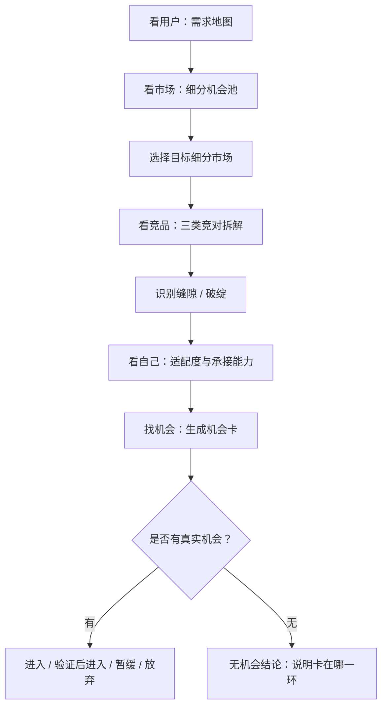

# 五看机会发现重构计划

更新时间：2026-08-28

## 1. 背景与目标

当前 App 已经具备市场、关键词、评论、竞品、利润、AI 报告、项目中心、云同步、成员权限等基础能力，但“五看”板块仍容易被理解为工具入口或表格集合。

本轮重构的目标不是继续堆功能，而是把“五看”改造成一套清晰的机会发现流程：

- 工具页负责明细分析：关键词表、评论原文、市场产品表、竞品 ASIN、利润测算等。
- 五看页负责核心判断：总结、证据、缺口、风险、下一步。
- 最终输出机会点，也允许输出“当前无机会”。
- 机会必须来自未被满足的需求，而不是只由市场规模或低竞争直接推导。

## 2. 产品判断框架

机会点来自两类逻辑：

1. 水涨船高，供小于求。
   - 用户需求明确或增长。
   - 细分市场趋势向上。
   - 现有供给质量、数量、表达或体验不足。

2. 我有人无，人有我优。
   - 对手没有满足某类关键需求。
   - 对手满足了但做得不够好。
   - 我方具备更好的产品、设计、供应链、运营或利润承接能力。

因此，五看流程应优先从用户需求出发，再判断市场，再拆竞品，再看自己，最后形成机会卡。

## 3. 重构后的主流程



## 4. 五看页面统一结构

每个五看页面不再以原始表格为主，而采用统一的信息架构：

```text
顶部：
- 一句核心判断
- 当前完成状态
- 推荐下一步 CTA

第一屏：
- 结论卡
- 关键证据
- 缺口 / 风险
- 下一步建议

第二屏：
- 图谱 / 矩阵 / 对比画布
- 只展示摘要，不堆原始表格

底部：
- 证据来源
- 关联工具入口
- 保存为机会证据 / 标记需复核
```

工具页继续保留明细能力：

| 工具页 | 职责 |
| --- | --- |
| 关键词工具 | 词表、搜索量、CPC、意图分层、JTBD 明细 |
| 评论工具 | VOC 标签、原文、好差评聚类、用户旅程 |
| 市场工具 | 产品表、趋势图、价格分布、品牌榜、细分市场计算 |
| 竞品工具 | ASIN 明细、Listing、流量词、父体矩阵、图片对比 |
| 利润工具 | FBA 测算、售价、成本、CPC、毛利情景 |

## 5. 看用户：需求地图

### 5.1 核心问题

- 用户有哪些真实需求？
- 他们是怎么搜索的？
- 决策路径可能是什么？
- 产品在用户眼里是怎么分类的？
- 哪些需求当前没有被满足？

### 5.2 页面内容

| 区块 | 内容 |
| --- | --- |
| 用户任务地图 | 按人群、场景、JTBD 组织需求 |
| 搜索路径 | 认知词 -> 比较词 -> 决策词 |
| 决策因子 | 价格、材质、尺寸、功能、效果、耐用性、信任背书等 |
| 用户心智分类 | 用户眼中的产品分类，而不是平台类目 |
| 未满足需求候选 | 从关键词和 VOC 中抽取候选需求 |

### 5.3 输出

- 需求分组。
- 用户决策路径。
- 用户心智分类。
- 候选未满足需求。
- 下一步推荐：进入看市场，验证对应细分市场是否值得做。

### 5.4 数据来源

- 关键词分析结果。
- 评论 VOC 标签。
- 用户洞察报告。
- 项目目标用户描述。

## 6. 看市场：细分机会池

### 6.1 核心问题

- 哪些用户需求对应的细分市场在增长？
- 哪些细分市场存在供小于求？
- 哪些细分市场规模足够、竞争结构仍可进入？
- 应该选择哪个细分市场进入竞品拆解？

### 6.2 页面内容

| 区块 | 内容 |
| --- | --- |
| 细分市场吸引力 | 规模、增长、集中度、价格带、上新窗口 |
| 趋势判断 | 水涨船高、存量红海、小众稳定、衰退风险 |
| 供需缺口 | 需求热度 vs 现有供给质量 |
| 细分市场排序 | 按机会评分排序，而不是单纯销售额排序 |
| 目标细分选择 | 选择一个细分市场作为看竞品输入 |

### 6.3 输出

- 细分市场机会排序。
- 每个细分市场的趋势判断。
- 目标细分市场。
- 下一步推荐：围绕目标细分市场选择三类竞对。

### 6.4 数据来源

- 市场大盘产品数据。
- 历史趋势数据。
- 细分市场规则。
- 用户需求地图。

## 7. 看竞品：三类竞对拆解

### 7.1 核心问题

- 当前细分市场里谁是绝对头部？
- 谁是头部的强力跟随者？
- 谁是新上架不久但表现不错的新链接？
- 他们靠什么赢？
- 他们哪里没有满足用户？
- 中间是否存在缝隙或破绽？

### 7.2 三类竞对

| 类型 | 选择逻辑 |
| --- | --- |
| 绝对头部 | 细分市场销量、销售额、排名或权重最强 |
| 强力跟随者 | 接近头部、有增长、有代表性，最好与头部形成对照 |
| 新链接 | 上架时间较短，但排名、销量、评论增长或关键词表现异常突出 |

### 7.3 页面内容

| 区块 | 内容 |
| --- | --- |
| 三竞对概览 | 三个 ASIN 的定位、价格、评分、评论量、上架时间、核心卖点 |
| 产品力拆解 | 功能、材质、设计、场景适配、体验痛点、差评原因 |
| 运营力拆解 | Listing 表达、主图策略、关键词覆盖、流量结构、价格策略、权重表现 |
| 优势 / 弱点矩阵 | 每个竞对的优势、短板、可攻击点 |
| 缝隙识别 | 用户需求与竞品供给之间没有被满足的区域 |

### 7.4 输出

- 竞品优势。
- 竞品弱点。
- 产品层面的差异化切口。
- 运营层面的差异化切口。
- 候选缝隙 / 破绽。
- 下一步推荐：进入看自己，判断能否承接该机会。

### 7.5 数据来源

- 当前目标细分市场。
- 自动挑选或手动选择的三个竞对。
- ASIN 详情。
- Listing / 图片 / 五点 / 流量词 / 父体矩阵。
- VOC 与关键词需求。

## 8. 看自己：适配度与承接能力

### 8.1 核心问题

- 我们能不能抓住这个机会？
- 我们适不适合做？
- 要怎么做才可能赢？
- 差异化属于“我有人无”还是“人有我优”？
- 利润模型能不能接得住？

### 8.2 页面内容

| 区块 | 内容 |
| --- | --- |
| 能力匹配 | 供应链、研发、设计、内容、广告、测评、交付周期 |
| 资源边界 | 预算、时间、MOQ、认证合规、人员投入 |
| 差异化可行性 | 我有人无、人有我优、无法差异化 |
| 利润承接 | 售价、成本、CPC、毛利、安全边界 |
| 风险清单 | 需求、竞争、产品、供应、合规、利润风险 |

### 8.3 输出

- 能做。
- 能做但要验证。
- 当前不适合。
- 证据不足。
- 下一步推荐：生成机会卡或补充缺失证据。

## 9. 找机会：机会卡与无机会结论

### 9.1 机会卡生成原则

机会卡必须以未满足需求为起点，并引用前四看的证据。

不能只因为以下原因生成正式机会：

- 市场规模大。
- 竞争度低。
- 某个关键词搜索量高。
- 某个竞品差评多。
- AI 主观认为有机会。

### 9.2 机会卡字段

| 字段 | 说明 |
| --- | --- |
| 机会名称 | 面向团队讨论的短标题 |
| 未满足需求 | 用户真正没有被满足的需求 |
| 目标用户 | 谁有这个需求 |
| 使用场景 | 在什么场景下发生 |
| 搜索与决策路径 | 用户怎么搜、怎么比较、怎么下单 |
| 市场依据 | 规模、增长、供需缺口、细分趋势 |
| 竞品破绽 | 产品力或运营力上的缺口 |
| 我方打法 | 我有人无 / 人有我优 / 组合优势 |
| 利润假设 | 售价、成本、CPC、毛利 |
| 主要风险 | 需求、竞争、产品、供应、合规、利润 |
| 验证动作 | 下一步要验证什么、谁负责、成功标准 |
| 决策建议 | 进入、验证后进入、暂缓、放弃 |

### 9.3 无机会结论

如果机会不成立，应明确输出“当前无机会”，并说明卡点：

| 卡点 | 说明 |
| --- | --- |
| 用户需求不强 | 搜索、评论或场景证据不足 |
| 市场不成立 | 规模太小、趋势差、价格带不支持 |
| 竞品壁垒太强 | 头部优势明显，缺口不真实 |
| 我方接不住 | 供应链、研发、预算、时间或运营能力不足 |
| 利润不成立 | 毛利、CPC、售价或成本无法覆盖 |
| 证据不足 | 无法得出进入或放弃判断，需要补充验证 |

## 10. P0：真实团队同步验收

### 10.1 目标

确认云同步、成员权限、删除传播、冲突处理和旧数据迁移可以支撑真实团队试用。

### 10.2 任务清单

| 优先级 | 任务 | 验收标准 |
| --- | --- | --- |
| P0 | 断网恢复测试 | 断网编辑后重新联网，项目内容、五看状态、报告资产不丢失 |
| P0 | 删除传播测试 | A 端删除项目后，B 端同步不再复活该项目 |
| P0 | 旧项目迁移测试 | 001 单人项目迁移到成员权限模型后，owner 可正常读写 |
| P0 | 权限测试 | owner 可管理成员，editor 可编辑，viewer 只读 |
| P0 | 并发冲突测试 | 双端同时编辑旧版本时，云端胜出，本地保留冲突副本 |
| P0 | Storage 恢复测试 | 大报告正文转存后，重新登录可下载并回填 |

### 10.3 交付物

- 更新 `docs/phase3-verification.md`。
- 记录每个验收场景的结果、账号、浏览器、环境、异常。
- 对失败场景建立修复任务。

## 11. P1：UI 回归验收

### 11.1 目标

确保重构前后核心页面没有严重展示错误，尤其是移动端、表格、报告和弹窗。

### 11.2 目标视口

| 视口 | 用途 |
| --- | --- |
| 390 x 844 | 手机竖屏 |
| 768 x 1024 | 平板 |
| 1280 x 800 | 笔记本 |
| 1440 x 900 | 桌面 |

### 11.3 页面范围

- 登录页 / 注册页。
- 项目中心。
- 项目概览。
- 五看工作台。
- 看用户 / 看市场 / 看竞品 / 看自己 / 找机会。
- 关键词、评论、市场、竞品、利润工具入口。
- 报告页。
- 设置页。
- 成员管理弹窗。

### 11.4 检查项

- 无乱码。
- 无 Markdown 源码泄漏。
- 无表格破裂。
- 无文字遮挡。
- 无按钮挤压。
- 无空白图表。
- 移动端主流程可操作。
- 同步状态和错误状态可理解。

## 12. P2：五看重构实施计划

### 阶段 1：信息架构与基础组件

目标：先搭统一骨架，不改变大量业务逻辑。

任务：

- 新增五看摘要组件。
- 抽象统一字段：核心判断、证据摘要、缺口、风险、下一步。
- 将工具入口统一放到底部或侧栏。
- 保留现有工具页，不删除原功能。

建议组件：

```text
FiveLookSummaryShell
FiveLookJudgementCard
EvidenceSummaryList
GapAndRiskPanel
NextActionPanel
LinkedToolsPanel
```

### 阶段 2：看用户重构

目标：把关键词和 VOC 结果沉淀为需求地图。

任务：

- 聚合关键词意图、JTBD、评论 VOC。
- 展示用户任务地图。
- 展示搜索路径。
- 展示用户心智分类。
- 生成未满足需求候选。
- 将候选需求保存为后续市场/竞品/机会输入。

### 阶段 3：看市场重构

目标：把市场页从数据看板改成细分机会池。

任务：

- 将细分市场按机会评分排序。
- 展示规模、趋势、集中度、价格带、上新窗口。
- 加入供需缺口判断。
- 支持选择目标细分市场。
- 将目标细分市场传递给看竞品。

### 阶段 4：看竞品重构

目标：围绕目标细分市场自动或手动选择三类竞对，并拆分产品力与运营力。

任务：

- 自动挑选绝对头部、强力跟随者、新链接。
- 支持手动替换竞对。
- 输出产品力优势/弱点。
- 输出运营力优势/弱点。
- 形成缝隙/破绽列表。

### 阶段 5：看自己重构

目标：把自评从表单变成机会承接判断。

任务：

- 汇总目标、能力、资源、约束。
- 判断差异化路径。
- 引入利润假设。
- 输出能做、能做但需验证、不适合、证据不足。

### 阶段 6：找机会重构

目标：形成机会卡或无机会结论。

任务：

- 机会卡必须引用前四看证据。
- 没有足够证据时只生成候选机会。
- 支持无机会状态。
- 支持决策建议。
- 支持验证动作。

## 13. P2：机会卡闭环强化

### 13.1 规则

- 机会从未满足需求生成。
- 机会必须关联用户、市场、竞品、自身证据。
- AI 可以解释和补全表述，但不能替代确定性评分和权限校验。
- 证据不足时不输出最终机会。
- 利润不成立时不能建议直接进入。

### 13.2 评分维度

| 维度 | 说明 |
| --- | --- |
| 用户需求强度 | 搜索、评论、场景、痛点是否一致 |
| 市场吸引力 | 规模、增长、集中度、价格带 |
| 竞品缺口 | 对手是否存在真实产品或运营破绽 |
| 我方适配度 | 能力、资源、供应链、运营是否接得住 |
| 利润可行性 | 毛利、成本、CPC、售价是否成立 |
| 证据覆盖度 | 前四看证据是否完整 |

### 13.3 状态

| 状态 | 含义 |
| --- | --- |
| 候选机会 | 有初步线索，但证据不足 |
| 已验证机会 | 前四看证据基本完整 |
| 需复核 | 来源数据更新后，原判断可能失效 |
| 无机会 | 当前链路没有成立机会 |
| 已决策 | 已选择进入、验证后进入、暂缓或放弃 |

## 14. P2：大组件拆分与维护性治理

### 14.1 当前风险

当前部分组件过大，后续五看重构时容易造成回归风险：

| 文件 | 风险 |
| --- | --- |
| `src/components/UserInsights.tsx` | 评论/VOC/报告/界面逻辑混在一起 |
| `src/components/CompetitorHub.tsx` | MCP 拉取、竞品分析、图片、报告、展示高度耦合 |
| `src/components/SegmentationManager.tsx` | 细分规则、AI 分组、表单和展示混合 |
| `src/components/LoginPage.tsx` | 登录、注册、游客、云账号说明和 UI 过重 |
| `src/components/ProjectWorkspace.tsx` | 五看容器与项目级动作可能继续膨胀 |

### 14.2 拆分原则

- 不做无目标大重构。
- 每次只围绕一个五看重构任务拆分。
- 纯计算逻辑进入 `src/utils`。
- 复用 UI 进入 `src/components/ui` 或明确的业务子组件。
- MCP/API 调用封装为 service 或 hook。
- 拆分后必须跑 `npm run lint` 和 `npm test`。

### 14.3 建议拆分方向

```text
src/components/five-look/
  FiveLookSummaryShell.tsx
  FiveLookJudgementCard.tsx
  EvidenceSummaryList.tsx
  GapAndRiskPanel.tsx
  NextActionPanel.tsx
  LinkedToolsPanel.tsx

src/components/user-look/
  UserDemandMap.tsx
  SearchDecisionPath.tsx
  UserMentalCategoryMap.tsx
  UnmetNeedCandidates.tsx

src/components/market-look/
  SegmentOpportunityPool.tsx
  SegmentTrendSummary.tsx
  SupplyDemandGapPanel.tsx

src/components/competitor-look/
  ThreeCompetitorSummary.tsx
  ProductPowerMatrix.tsx
  OperationPowerMatrix.tsx
  CompetitorGapPanel.tsx

src/components/self-look/
  CapabilityFitPanel.tsx
  ResourceBoundaryPanel.tsx
  DifferentiationFitPanel.tsx
  ProfitFitSummary.tsx

src/components/opportunity/
  OpportunityCardList.tsx
  OpportunityEvidenceCoverage.tsx
  NoOpportunityConclusion.tsx
```

## 15. 建议执行顺序

1. P0 真实团队同步验收。
2. P1 UI 回归验收，修正明显展示与文案问题。
3. P2 阶段 1：建立五看统一摘要骨架。
4. P2 阶段 2：重构看用户。
5. P2 阶段 3：重构看市场，并打通目标细分选择。
6. P2 阶段 4：重构看竞品，形成三竞对产品/运营拆解。
7. P2 阶段 5：重构看自己，形成承接判断。
8. P2 阶段 6：重构找机会，支持机会卡和无机会结论。
9. 每完成一个阶段，执行 `npm run lint`、`npm test` 和目标视口 UI 检查。

## 16. 第一轮建议落地范围

第一轮不要一次性重写所有五看。建议先完成：

- 新增统一五看摘要骨架。
- 看用户摘要页改造。
- 看市场摘要页改造。
- 目标细分市场选择与项目状态保存。
- 保留原关键词、评论、市场工具页作为明细入口。

第一轮完成后，用户应能清楚看到：

```text
用户有什么需求
-> 哪些需求对应的细分市场值得看
-> 应该选择哪个细分市场继续拆竞品
```

这会为后续三竞对分析和机会卡闭环打下基础。

